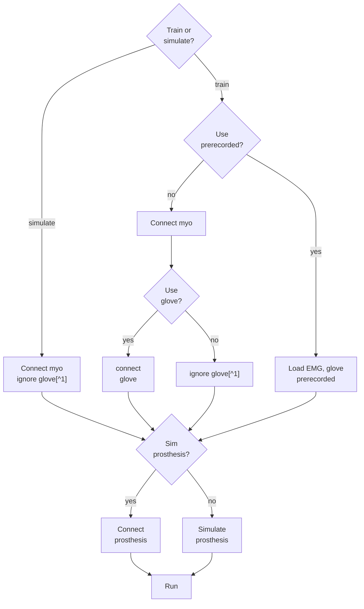

# Prosthesis EPN v2
Code to run the agent that operates the flexible prosthesis EPN v2.
The agent was trained to imitate the movements open and close of the hand. 
It uses the Myo Armband and the flexible prosthesis with an Wemos D1 ESPR32.
 

# Execution
## Manual operation
Just run the app **manualOperation.mlapp**.

## Execution [Real time recognition]
* Change the COM port of the prosthesis device in 'config\configurables.m'.
* Check that the simulation flag *params.simMotors* is false, in the script **config/configurables.m**, line 55-56.
* Run the script **runProsthesis.m**.

## Half-hardware execution
When simulating the motors, but using the Myo armband or viceversa, the program has included a time delay to simulate the time it takes to move the prosthesis. It is determined automatically when either the flags ``simMotors`` or ``usePrerecorded`` are false.

## Training
* Choose if you want to train in simulation or in hardware prostheshis with the flag *params.simMotors* in the script **config/configurables.m**, line 55-56.

### New training
* Set the flag ``newTraining`` to true in the script **src/trainInterface.m**.
* Run the script **src/trainInterface.m**.
* The agent trained will be saved in **trainedAgents/**.
### Continue previous training
* Set the flag ``newTraining`` to false in the script **src/trainInterface.m**.
* Set the ``agentFile`` variable and the ``name`` in the script **src/trainInterface.m**, line 42-43 as correspoding to continue training.
* Run the script **src/trainInterface.m**.

## Fine tuning
* Set the flag ``newTraining`` to false in the script **src/fineTuning.m**.
* Set the ``agentFile`` variable and the ``name`` in the script **src/fineTuning.m**, line 34-35 as correspoding to continue training.
* Run the script **src/fineTuning.m**.

## Evaluation of the random agent
* Set the number of episodes in ``params.simOpts`` in the file **config/configurables.m**, lines 158-162.
* Select the random agent corresponding function (such as ``cMomen2_createAgent``) in the script **src/evalRandomAgent.m**, line 34.
* Run the script **src/evalRandomAgent.m**.

## Evaluation of the trained agent
Similarly, run the script **src/evalTrainedAgent.m**.

# Project structure description
* parameters and configs can be changed in *./config/*.
* Agent are defined in folder *./agents/*.
* Trained agents are saved in *./trainedAgents/*.
* Main scripts are in the folder *./src/*.
* Temporal files, datasets and backup are saved in *./data/*.
* In every folder is a readme with a general description.


# Dependencies
* Signal Processing Toolbox
* Reinforcement Learning Toolbox
* Deep Learning Toolbox
* mingw compiler
*  Curve Fitting Toolbox [pending]

* **Myo mex**

# Hardware logic

[^1]: ignoring glove uses a mock. 
# Important notes
## Myomex install
This repository comes with the mex function for Windows 10, intel 64bits. In case you need to compile it again, follow the steps described in Myo mex.

## Matlab version changes
* Code developed in Matlab 2021b. 

* For some strange reason in Matlab 2022b code had to be changed.

To handle this issue the following version checking code was added in file 'src/@Env/step/' line 19-22.

```MATLAB
if ~isequal(matlabRelease.Release, "R2021b")
    %adjusting changes in toolbox apart from R2021b
    action = action{1};
end
```

This change fixes problems for **runProsthesis.m**.

Training might need to implement a similar change.


